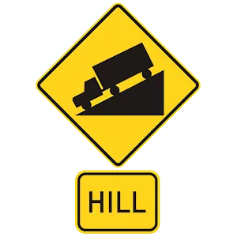
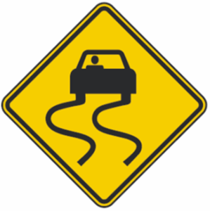
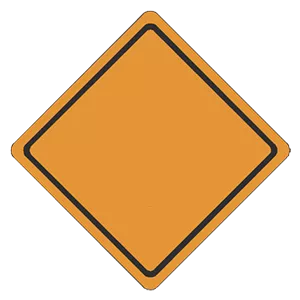
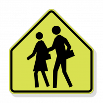
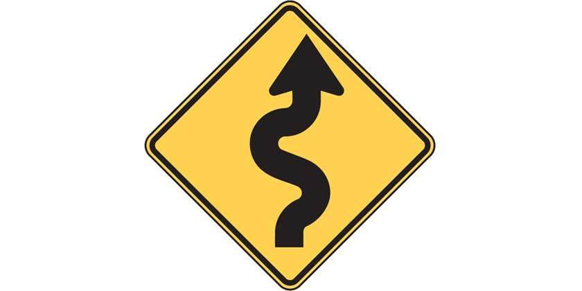
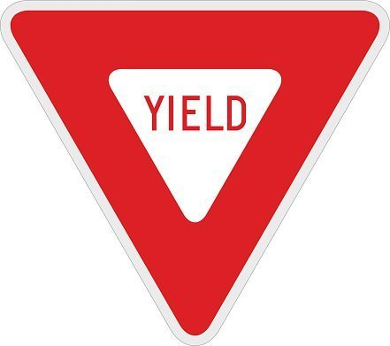
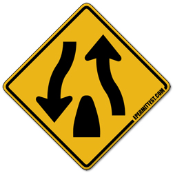

## Driver's License Written Exam - Cheat Sheet

### Limit's

| Cause | Action |
| :---- | :---- |
| No-Zone | there is no such thing |
| Penalty for letting a person without license drive | vehicle is impounded |
| Consent for extra testing if | if asked by law enforcement |
| Approach intersection at posted speed when signal light turns yellow | stop before entering intersection, if you can do so safely |
| Rear facing car seat age limit | 2 years |
| Drinks limit | 1 |
| Broken yellow centerline | |
| Merging onto the freeway | at or near the same speed as the traffic |
| Driving in fog | low beams |
| driving in icy or snowy conditions | Reduce speed and increase following distance |
| flashing red traffic signal at an intersection | stop sign |
| White painted curb | loading zone for passengers and mail only |
| Yellow painted curb | Stop no longer than the time posted to load or unload passengers or freight. |
| School bus stopped and red lights flashing | stop as long as the red lights are flashing |
| Calif’s basic speed law | never drive faster than is safe for current conditions |
| Sold your vehicle | notify DMV in 5 days |
| You always should imagine where your vehicle will be in 5 to 10 seconds |
| tire suddenly blows out | Grip the steering wheel firmly, slow down and exit from the traffic lanes |
| Residential area speed limit | 25 mph |
| Blind spots | large vehicles have bigger blind spots |

 
 

### Parking near curb

| Parking style | Rule |
| :----: | :---- |
| level street | 18 inches of the curb |
| Uphill | turn front wheels away from the curb; right; away from the street |
| Downhill | turn front wheels toward the curb |
| Without curb | always turn your front wheels to the right |

 
 

### Sign's

| Image | Tag |
|:----:|---:|
|  | Hill Sign |
|  | Slippery When Wet |
|  | Road Construction |
|  | school zone |
|  | Winding Road |
|  | Yield |
|  | Divided  |

 
 

### Child Restraint System and Safety Seats

| Conditions | Fact |
| :----: | :----: |
| `< 2 years & < 40 lbs & < 40" tall` | rear facing car seat |
| `< 2 years & < 40 lbs & < 40" tall` | front facing car seat |

 
 

### Lane Colors

| Conditions | Fact |
| :---- | :---- |
| Solid yellow | mark the center of a road used for two-way traffic |
| Broken yellow | indicate that you may pass if the broken line is next to your driving lane |
| Two solid yellow | indicate no passing. Never drive to the left of these lines unless you are: `In a carpool lane/high occupancy vehicle (HOV) lane that has a designated entrance on the left.Instructed by construction or other signs to drive on the other side of the road because your side of the road is closed or blocked.Turning left across a single set of double yellow lines to enter or exit a driveway or private road, or make a U-turn.`
| Two sets of solid double yellow lines spaced 2 feet or more | a barrier. Do not drive on or over this barrier, make a left turn, or a U-turn across it, except at designated openings (see diagram). |
|    double white line    |    lane changing is prohibited    |
|    single white line    |    lane changing is discouraged    |
|    dashed white line    |    lane changing in allowed    |

### Hand singals

|    Signal    |    Action    |
|    :----    |    :----    |
|    point arm down; fingers extended and palm facing rearward |    indicating traffic behind to prepare to stop    |
|    Extend your left arm straight out the window, palm forward    |    indicating a left turn    |
|    extend your left arm out the driver's window with your elbow bent and point your hand to the sky with your palm facing forward    | indicating a right turn    |

#### Flutter App Screenshots

<table>
  <tr>
    <td>First Screen Page</td>
    <td>Holiday Mention</td>
    <td>Present day in purple and selected day in pink</td>
  </tr>
  <tr>
    <td>

| Parking style | Rule |
| :----: | :---- |
| level street | 18 inches of the curb |
| Uphill | turn front wheels away from the curb; right; away from the street |
| Downhill | turn front wheels toward the curb |
| Without curb | always turn your front wheels to the right |

    </td>
    <td>

| Conditions | Fact |
| :----: | :----: |
| `< 2 years & < 40 lbs & < 40" tall` | rear facing car seat |
| `< 2 years & < 40 lbs & < 40" tall` | front facing car seat |

    </td>
    <td>
<pre>
|    Signal    |    Action    |
|    :----    |    :----    |
|    point arm down; fingers extended and palm facing rearward |    indicating traffic behind to prepare to stop    |
|    Extend your left arm straight out the window, palm forward    |    indicating a left turn    |
|    extend your left arm out the driver's window with your elbow bent and point your hand to the sky with your palm facing forward    | indicating a right turn    |
</pre>
    </td>
  </tr>
 </table>